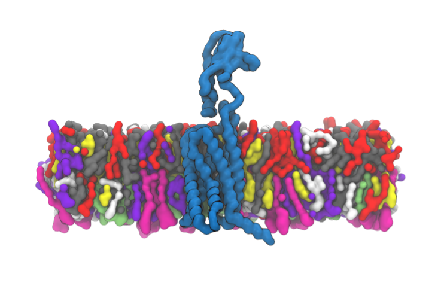
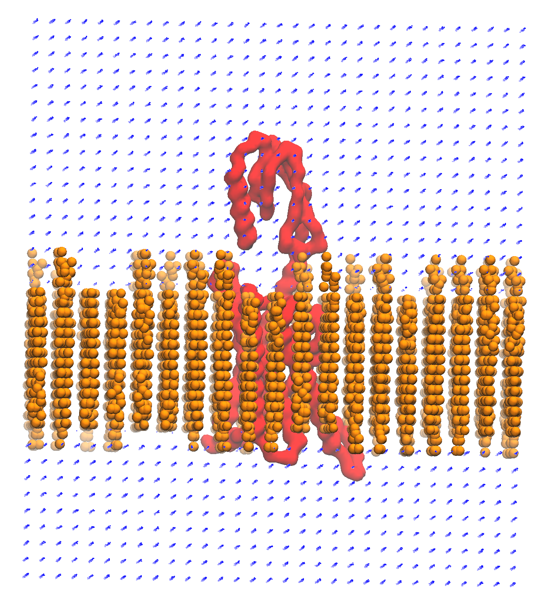

=================================================================
Advanced Data Provenance - Coarse-grained setup of embedded GPCR
=================================================================

Introduction
------------
In this tutorial, we will go through how to set-up a coarse-grained molecular system of a PTH2R (Parathyroid hormone receptor type 2) protein embedded in a lipid bilayer membrane along with water and counter-ions. We will use the command-line tools provided in aiida-gromacs to track each step performed on the terminal.

Preparing the environment
----------------------------
For this tutorial, some additional software is required as well as the local installation of GROMACS and the aiida-gromacs plugin that we used in the previous tutorial. This software is best installed into the environment that aiida-gromacs and AiiDA were installed in, so begin by activating this environment. We then need to start the AiiDA database and daemon using the first three steps from our `user guide <https://aiida-gromacs.readthedocs.io/en/latest/user_guide/aiida_sessions.html#start-stop-aiida>`__.
Make a new directory called PTH2R_Tutorial and navigate to it using these commands:

   .. code-block:: bash

         mkdir PTH2R_Tutorial

   .. code-block:: bash

         cd PTH2R_Tutorial

Into this directory, download all the `required tutorial files <https://github.com/PSDI-UK/aiida-gromacs/tree/master/examples/PTH2R_coarse-grained_files/gromacs>`__, including the "toppar" directory. A python script is needed to build the coarse-grained system, `download this <https://github.com/PSDI-UK/aiida-gromacs/blob/master/examples/PTH2R_coarse-grained_files/insane/insane_custom.py>`__ into the directory also.

Software and environment requirements
-------------------------------------
* `martinize2 <https://pypi.org/project/vermouth/>`__ is used to convert from atomistic to coarse-grained structures.

* A modified `insane <https://github.com/Tsjerk/Insane>`__ script is used to build the coarse-grained system.

* A local installation of `GROMACS <https://www.gromacs.org/>`__ is required to perform molecular dynamics simulations.

* `aiida-gromacs <https://aiida-gromacs.readthedocs.io/en/latest/user_guide/installation.html#plugin-installation>`__ is used to keep track of all the commands used to setup and perform the simulation.

* `dssp <https://anaconda.org/salilab/dssp>`__ is used by ``martinize2`` to find secondary structures in the protein.

.. note::
    martinize2 can be installed via the link above, but **please install dssp via the following commands** if using **Linux**:

     .. code-block:: bash

         mamba install anaconda::libboost=1.73.0

     .. code-block:: bash

         mamba install -c salilab dssp

And if using **MacOS**:

   .. code-block:: bash

        mamba install anaconda::libboost=1.73.0

   .. code-block:: bash

        mamba install -c salilab dssp/osx-64::dssp

This is to ensure compatibility with aiida-gromacs; issues may occur if dssp is installed using alternative methods.

Aquiring and tidying up the receptor protein structure
------------------------------------------------------

Our starting point is the PTH2R `structure <https://gpcrdb.org/protein/pth2r_human/>`_ from the GPCRdb.

1. First, we download the PTH2R protein from the GPCRdb using ``curl``. We will track our commands as we perform them using the ``genericMD`` command in aiida-gromacs (note that this and all following commands use the **Linux** command line syntax; this will need to be adjusted appropriately if using MacOS) :

    .. code-block:: bash

       PTH2R="ClassB1_pth2r_human_Active_AF_2022-08-16_GPCRdb"

       genericMD --code bash@localhost \
       --command "curl https://gpcrdb.org/structure/homology_models/pth2r_human_active_full/download_pdb -o $PTH2R.zip " \
       --outputs $PTH2R.zip

   Remember to check on the success of each command using:

     .. code-block:: bash

        verdi process list -a

The Process State column of the readout generated by this command should read Finished[0] - if another number is shown, an error has occured. Tasks that have not yet completed will show as "Waiting Monitoring scheduler: job state RUNNING" - check that their status has been updated to Finished before proceeding to the next step.

2. We then need to ``unzip`` the downloaded file:

    .. code-block:: bash

       genericMD --code bash@localhost \
       --command "unzip $PTH2R.zip" \
       --inputs $PTH2R.zip --outputs $PTH2R.pdb

3. Now that we have the pdb file, we can remove regions of low confidence at the start and end of the receptor chain. We use the ``sed`` command to programmatically delete lines that correspond to low confidence regions between residues 1-31 and 435-550 inclusive. Don't forget to check the edited file to make sure that the sed command has worked as expected, as ``verdi process list -a`` will only show if an executed command was succesful, not if it did what we wanted it to!

     .. code-block:: bash

        genericMD --code bash@localhost \
        --command "sed -i -e '1,217d;3502,4387d' $PTH2R.pdb" \
        --inputs $PTH2R.pdb \
        --outputs $PTH2R.pdb

Aligning PTH2R to a correctly orientated structure
--------------------------------------------------

4. Next, we download the correctly orientated structure from the OPM database.

    .. code-block:: bash

        genericMD --code bash@localhost \
        --command "curl https://opm-assets.storage.googleapis.com/pdb/7f16.pdb -o PTH2R_opm.pdb " \
        --outputs PTH2R_opm.pdb

5. PTH2R is a receptor for the parathyroid hormone and the OPM downloaded structure contains the coupled G-protein along with other bound molecules. We will keep only the receptor using the ``sed`` command to remove lines that do not correspond to the receptor:

    .. code-block:: bash

        genericMD --code bash@localhost \
        --command "sed -i -e '2,761d;3835,13708d' PTH2R_opm.pdb" \
        --inputs PTH2R_opm.pdb \
        --outputs PTH2R_opm.pdb

The final step for preparing the PTH2R protein is to position the structure in the correct orientation by aligning against the structure downloaded from the OPM database. There are a few ways to orientate the protein, here we use the orientations of proteins in membranes (OPM) database `structure <https://opm.phar.umich.edu/proteins/7900>`__ as a template to align our protein with. The OPM structure is correctly orientated to fit around a membrane and uses the `7F16 <https://www.rcsb.org/structure/7F16>`_ PDB deposited structure, however, this structure has missing atoms, so we cannot use this structure directly. There is an option to use the PPM webserver to orientate the protein correctly, however, no command-line tool is currently available, so we will not use this here.

6. We use the ``confrms`` command in GROMACS to align our structure. We will carry on using ``genericMD`` to track this command and use the ``echo`` command to include the interactive options required by ``confrms``:

    .. code-block:: bash

        genericMD --code bash@localhost \
        --command "echo -e '0 | 0 \n q' | gmx confrms -f1 PTH2R_opm.pdb -f2 $PTH2R.pdb -name -one -o PTH2R_fit.pdb" \
        --inputs PTH2R_opm.pdb --inputs $PTH2R.pdb \
        --outputs PTH2R_fit.pdb

Building a coarse-grained system from an atomic structure
---------------------------------------------------------

Now that we have the correct starting structure of the receptor, we move onto coarse-graining.

7. We use Martinize2 to coarse-grain the atomistic structure and produce a GROMACS topology file

    .. code-block:: bash

        genericMD --code martinize2@localhost --command "-f PTH2R_fit.pdb -o PTH2R_opm.top -x PTH2R_opm.cg.pdb -ff martini3001 -nt -dssp mkdssp -elastic -p backbone -maxwarn 2 -mutate HSD:HIS -mutate HSP:HIH -ignh -cys auto -scfix" \
        --inputs PTH2R_fit.pdb \
        --outputs PTH2R_opm.top --outputs PTH2R_opm.cg.pdb --outputs molecule_0.itp

Adding the membrane and solution around the protein with ``insane``
-------------------------------------------------------------------

8. Next, we use our custom insane.py python script to embed the protein into a lipid bilayer and solvate the system. Our insane script is modified from `the Melo lab <https://github.com/MeloLab/PhosphoinositideParameters/blob/main/martini3/insane.py>`_, it has been updated to python3 and contains additional parameters for the GM3 carbohydrate.

    .. code-block:: bash

        genericMD --code python@localhost --command "insane_custom.py -f PTH2R_opm.cg.pdb -o solvated.gro -p system.top -pbc rectangular -box 18,18,17 -u POPC:25 -u DOPC:25 -u POPE:8 -u DOPE:7 -u CHOL:25 -u DPG3:10 -l POPC:5 -l DOPC:5 -l POPE:20 -l DOPE:20 -l CHOL:25 -l POPS:8 -l DOPS:7 -l POP2:10 -sol W" \
        --inputs insane_custom.py --inputs PTH2R_opm.cg.pdb \
        --outputs solvated.gro --outputs system.top

Preparing the system for simulation
------------------------------------

9. Once the topology file is created, we need to include all the itp files containing the force field parameters used to describe interactions between beads. Make sure that the "toppar" directory was downloaded into the working directory, PTH2R_Tutorial, or alternatively adjust the address of the toppar directory to the appropriate location in the commands given below. We use the ``sed`` command again to edit the ``system.top`` file directly on the command-line, to include all the itp files, and we submit this command via ``genericMD`` as with the previous commands.

    .. code-block:: bash

        genericMD --code bash@localhost \
        --command "sed -i '1i #include\ \"toppar/martini_v3.0.0.itp\"\\n#include\ \"toppar/martini_v3.0.0_ions_v1.itp\"\\n#include\ \"toppar/martini_v3.0.0_solvents_v1.itp\"\\n#include\ \"toppar/martini_v3.0.0_phospholipids_v1.itp\"\\n#include\ \"martini_v3.0_sterols_v1.0.itp\"\\n#include\ \"POP2.itp\"\\n#include\ \"molecule_0.itp\"\\n#include\ \"gm3_final.itp\"' system.top" \
         --inputs system.top \
         --outputs system.top

   We also need to rename "Protein" in this file to "molecule_0" to match the information in the other files, and remove the line "#include martini.itp" as this will clash with the martini_v3.0.0.itp file that we wish to use. To do this, we will use the sed command again:

      .. code-block:: bash

           genericMD --code bash@localhost \
           --command "sed -i -e 's/Protein/molecule_0/' -e 's/#include \\\"martini.itp\\\"/\\n/' system.top" \
           --inputs system.top \
           --outputs system.top

10. We also need to edit the ``molecule_0.itp`` file generated from the Martinize2 step to include positional restraints on the coarse-grained beads.

      .. code-block:: bash

        genericMD --code bash@localhost \
        --command "sed -i -e 's/1000 1000 1000/ POSRES_FC    POSRES_FC    POSRES_FC /g' \
        -e 's/#ifdef POSRES/#ifdef POSRES\\n#ifndef POSRES_FC\\n#define POSRES_FC 1000.00\\n#endif/' molecule_0.itp" \
        --inputs molecule_0.itp \
        --outputs molecule_0.itp

11. Ions need to be added to neutralise the system and we can construct the GROMACS ``.tpr`` binary file containing the system configuration, topology and input parameters for the next step. We use the ``gmx_grompp`` command (note the underscore), which is wrapper command to run ``gmx`` via aiida-gromacs. We have included the most popular ``gmx`` commands in aiida-gromacs, the list of these are provided `here <https://aiida-gromacs.readthedocs.io/en/latest/user_guide/cli_interface.html>`_.

      .. code-block:: bash

          gmx_grompp -f ions.mdp -c solvated.gro -p system.top -o ions.tpr

12. The ``gmx_genion`` command is then used to add the ions to reach a particular salt concentration and neutralise the system. As the ``genion`` command requires interactive user inputs, we can provide these in as an additional text file via the ``--instructions`` argument. Each interactive response can be provided on a new line in the input text file. In this example, we replace solvent ``W`` with ions,

     .. code-block:: bash

          gmx_genion -s ions.tpr -o solvated_ions.gro -p system.top -pname NA -nname CL -conc 0.15 -neutral true --instructions inputs_genion.txt

    where `inputs_genion.txt <https://github.com/PSDI-UK/aiida-gromacs/blob/master/examples/PTH2R_coarse-grained_files/gromacs/inputs_genion.txt>`_ contains the following lines:

        .. code-block:: bash

            W

13. Lastly, we will use a ``gmx_make_ndx`` to create new index groups for the membrane and solute consituents

        .. code-block:: bash

            gmx_make_ndx -f solvated_ions.gro -o index.ndx --instructions inputs_index.txt

    where `inputs_index.txt <https://github.com/PSDI-UK/aiida-gromacs/blob/master/examples/PTH2R_coarse-grained_files/gromacs/inputs_genion.txt>`_ contains the following lines:

            .. code-block:: bash

                13|14|15|16|17|18|19|20|21
                name 26 membrane
                22|23|24
                name 27 solute
                q

We have built our starting configuration of an embedded protein in a lipid bilayer, hurray!

Continuing on to the MD simulation
----------------------------------

Now that the intial system is prepared, it is sensible to first visualise the system to ensure the protein is correctly oreintated and embedded in the membrane. Use your favourite visualisation tool to view the ``solvated_ions.gro`` file. Some recommendations and tutorials for visualisation are provided below.

Visualisation tools
^^^^^^^^^^^^^^^^^^^

* `VMD <http://www.ks.uiuc.edu/Training/Tutorials/vmd-index.html>`_

* `PyMol <https://pymolwiki.org/index.php/Category:Tutorials>`_

* `Chimera <https://www.cgl.ucsf.edu/chimera/docs/UsersGuide/frametut.html>`_

Your starting configuration should look something like the image below:

As you can see, the system is very ordered and will need to be relaxed before running a simulation. The next steps are to minimise the energy of the initial configuration and then equilibrate the system to the correct temperature and pressure. As there are many components in this system, restraints should be used to slowly relax the system without causing large structural changes.

Minimisation and equilibration steps
^^^^^^^^^^^^^^^^^^^^^^^^^^^^^^^^^^^^

There are multiple stepds involved in minimising and equilibrating the simulation, the first of which is provided below.

    .. code-block:: bash

        gmx_grompp -f MDstep_1.0_minimization.mdp -c solvated_ions.gro -r solvated_ions.gro -p system.top -o MDstep_1.0_minimization.tpr -n index.ndx -maxwarn 1

    .. code-block:: bash

        gmx_mdrun -s MDstep_1.0_minimization.tpr -c MDstep_1.0_minimization.gro -e MDstep_1.0_minimization.edr -g MDstep_1.0_minimization.log -o MDstep_1.0_minimization.trr

There are several more steps to perform, can you complete the rest of the simulation? If you need help, the full list of steps can be found in this `bash script <https://github.com/PSDI-UK/aiida-gromacs/blob/master/examples/PTH2R_coarse-grained_files/gromacs/aiida-example-gmx.sh>`_. Good luck!

Acknowledgements
----------------

Thanks to Kin Chao for providing the intial raw files for setting up the coarse-grained system and the input files for the GROMACS simulation.
