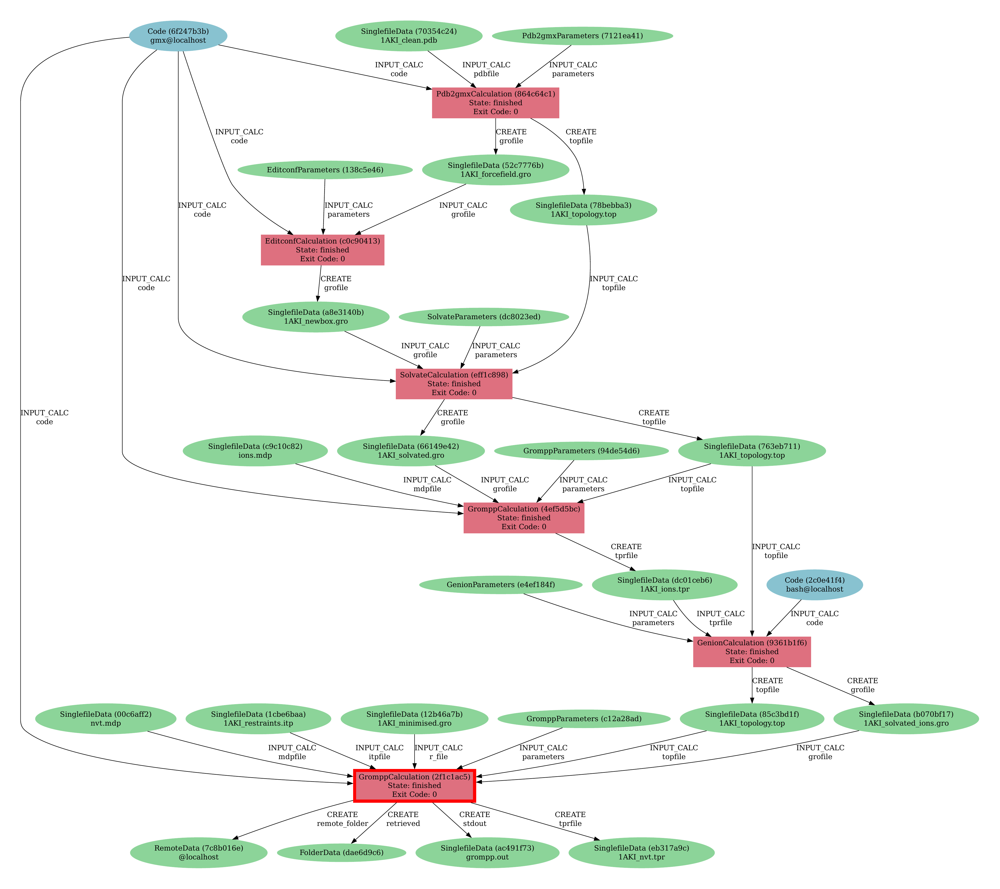

====================
AiiDA CLI Cheatsheet
====================

Here we will list some useful commands for working with AiiDA. Have a look `here <https://aiida.readthedocs.io/projects/aiida-core/en/latest/reference/command_line.html?highlight=verdi%20process%20list>`_ to explore all available AiiDA command line subcommands.

Monitoring Submitted Processes
------------------------------

List all submitted processes:

.. code-block:: bash

    verdi process list -a

Delete a process node, identified by its primary key value ``<PK>``:

.. code-block:: bash

    verdi node delete <PK>

Delete multiple process nodes between primary key values ``<PK_1>`` and ``<PK_n>``:

.. code-block:: bash

    verdi node delete {<PK_1>..<PK_n>}

View all the nodes associated with a process node:

.. code-block:: bash

    verdi node show <PK>

View attributes of a process node (such as retrieved files and find the path on disk where outputs are stored temporarily):

.. code-block:: bash

    verdi node attributes <PK>

From the node attributes output dictionary, you can find where the input and output files are temporarily stored for a process in the "remote_workdir" value.

Debugging
---------

Any aiida errors are logged in ``.aiida/daemon/log/``.

If any changes to the plugin code are made, after an update for example, restart the daemon if it is already running to implement the code changes:

.. code-block:: bash

    verdi daemon restart --reset

To view details of a submitted process, such as the inputs, state, log messages, etc., use the following command:

.. code-block:: bash

    verdi process show <PK>

To view where in the source code an exception has occured if a calculation has failed:

.. code-block:: bash

        verdi process report <PK>

Sharing Data
------------

When you are ready to share data, the AiiDA database and accompanying files inputted and outputted in each process can be `archived <https://aiida.readthedocs.io/projects/aiida-core/en/latest/howto/share_data.html>`_ into a single file:

.. code-block:: bash

    verdi archive create --all archive_name.aiida

where the ``--all`` flag saves all the data in the AiiDA profile.

To import an existing AiiDA archive file to a loaded profile:

.. code-block:: bash

    verdi archive import archive_name.aiida

Visualise Data Provenance
-------------------------

Visualise your submitted jobs as a provenance graph outputted in a ``.pdf`` file. Select the latest ``<PK>`` to include all previous nodes in the graph:

.. code-block:: bash

    verdi node graph generate <PK>

An example provenance graph for the first eight steps of the :ref:`lysozyme tutorial <tutorial>`, will look something like this:

Plugin Specfic AiiDA Commands
-----------------------------

The following commands are only available with the aiida-gromacs plugin.

Show Provenance on CLI
^^^^^^^^^^^^^^^^^^^^^^

Show a list of the commands run and the connected inputs/outputs associated with any processes that have been run using:

.. code-block:: bash

    verdi data provenance show

An example output on the command line will look like this:

    .. code-block :: console

        Step 1.
                command: gmx pdb2gmx -f 1AKI_clean.pdb -ff oplsaa -water spce -o 1AKI_forcefield.gro -p 1AKI_topology.top -i 1AKI_restraints.itp
                executable: gmx
                input files:
                        1AKI_clean.pdb
                output files:
                        pdb2gmx.out
                        1AKI_forcefield.gro
                        1AKI_topology.top
                        1AKI_restraints.itp

        Step 2.
                command: gmx editconf -f 1AKI_forcefield.gro -center 0 -d 1.0 -bt cubic -o 1AKI_newbox.gro
                executable: gmx
                input files:
                        1AKI_forcefield.gro <-- from Step 1.
                output files:
                        editconf.out
                        1AKI_newbox.gro

        Step 3.
                command: gmx solvate -cp 1AKI_newbox.gro -cs spc216.gro -p 1AKI_topology.top -o 1AKI_solvated.gro
                executable: gmx
                input files:
                        1AKI_newbox.gro <-- from Step 2.
                        1AKI_topology.top <-- from Step 1.
                output files:
                        solvate.out
                        1AKI_solvated.gro
                        1AKI_topology.top
